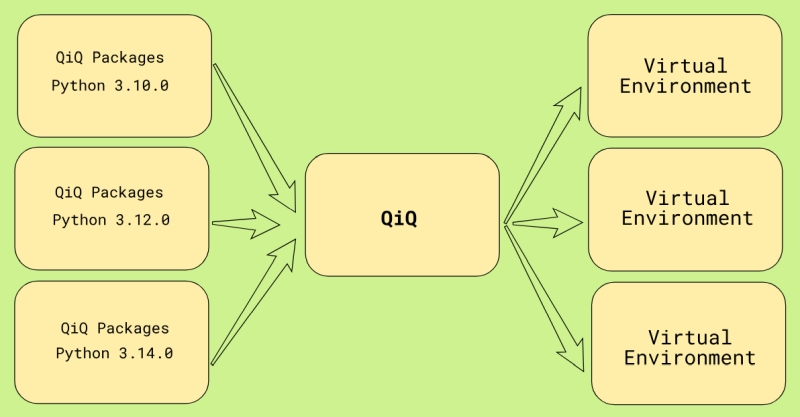

# ⭐️ QiQ Documentation 0.6.0

QiQ, pronounced as _quick_ is a comprehensive Python management tool. It functions as a Python installer, an extremely lightweight virtual environment maker that does not require copying the Python interpreter, and a unified package management system for managing numerous versions of same packages in a central repository.  Let's look at the features in depth.



## 🚀 Features

:point_right: **Python Installer**

Quickly install or uninstall required version of python. 

:point_right: **Virtual Environment Creation**

Create an incredibly lightweight virtual environment that contains no copies of the Python interpreter or packages. The entire virtual environment is built on three files: activation, deactivation, and package list.

:point_right: **Virtual Environment Change**

You can simply switch the virtual environment to a different version of Python to test the compatibility of your code. There's no need to construct another virtual environment.

:point_right: **Unified Package Management**

QiQ presents a new Python package management system that allows you to install several versions of a package and utilize them when needed. These packages are managed in a single unified environment, so you do not need to install them separately for each virtual environment.

:point_right: **Project Management**

Every virtual environment in QiQ is considered a project, and QiQ effortlessly maintains all of them, including their package requirements. You may rapidly check the list of projects, package utilization across many projects, and so on.

:point_right: **Easy on disk space**

Every virtual environment is truly virtual, with no separate copies of the interpreter or packages. This saves a huge disk compare to existing virtual environment systems.

:point_right: **Seamless integration**

QiQ enables for smooth connection with existing tools like as pip, conda, etc.
You do not need to use QiQ to publish or deploy your product.
To learn more about seamless integration, read [this](#-seamless-integration).

____

## 📦 Requirements

* Python >= 3.10
* Windows >= 10
* Linux (Tested on Mint 22.3 - Cinnamon)
* macOS >= 11.7.1 (Big Sur)

____

## ⚙️ Installation

Clone this repository first. Make sure to clone it to a drive with appropriate capacity, as everything will be managed within this directory. It is best to clone to an SSD.

```bash
git clone https://github.com/the-code-monk/qiq.git
```

Once cloned, open the terminal and cd in the repository. On Windows type this command to add the path to Windows environment.

```bash
install.bat
```

On linux you can type

```bash
install.sh
```

to add the path permanently to bash environment.

----

## 📄 Commands

### 🟢 Install Python:

**`-ipy` or `--install-python`**

```bash
qiq --install-python 3.12.13
```

You can see the list of available Python versions [here](https://www.python.org/ftp/python/).

----

### 🟢 Uninstall a Python version

**`-upy` or `--uninstall-python`**

```bash
qiq --uninstall-python 3.12.13
```

----

### 🟢 List of installed Pythons

**`-envs` or `--environments`**

```bash
qiq --environments
```

----

### 🟢 Virtual environment creation

Change to the location in which you want to construct the virtual environment and run this command. Make careful to use the Python version you installed earlier.

**`-venv` or `--virtual-environment`**

```bash
qiq -venv 3.12.13
```

This will create a _.qiq_ directory with two files for the activation and deactivation of environment. That's it.
On **Windows** you can type these commands to activate or deactivate the environment.

**cmd** or **Terminal**

```bash
.qiq\activate.bat
.qiq\deactivate.bat
```

**powershell** (Recommended)

```powershell
. .\.qiq\activate.ps1
. .\.qiq\deactivate.ps1
```

⚠️ That leading dot + space is important.

On **Linux**

```bash
source .qiq\activate.sh
source .qiq\deactivate.sh
```

Now python is available at prompt. Type **python** on **Windows** and **pythonx.xx** on **Linux**
Once you have activated the virtual environment prompt, these set of commands are available:

----

### 🟢 Install packages

**`-i` or `--install`**

```bash
qiq --install numpy onnx
qiq --install numpy==2.3.4
```

This will install the packages in the central repository where the python is installed. QiQ is not going to install any packages with in the environment.

#### 🟢 List installed packages

**`-l` or `--list`**

```bash
qiq -l              # List all the packages
qiq -l numpy opencv # List packages with name
qiq -l onnx*        # List packages starts with
```

----

### 🟢 Tree view of a package and it's dependencies

**`-t` or `--tree`**

```bash
qiq -tree numpy==2.2.6
```

----

### 🟢 Require packages

**`-r` or `--require`**

```bash
qiq -r requirements.txt
```

This is the most important part of QiQ. To understand it let's create a sample project first. Create a new directory and initialize the virtual environment first as explained above.

```bash
qiq -venv 3.12.13
```

Now create two files in this directory.

```bash
main.py
requirements.txt
```

Open requirements.txt in a text editor and type this and save it

```bash
numpy==2.3.4
```

Now open main.py in the choice of your editor and type this and save it.

```python
import numpy as np
```

Now type this on you virtual environment prompt

```bash
python main.py
```

This will throw an error

```bash
ModuleNotFoundError: No module named 'numpy'
```

Numpy was installed earlier using QiQ but not in python environment. In order to use it we must tell QiQ to use in this project. In order to do so type

```bash
qiq --require requirements.txt
```

This creates qiq.json file in the .qiq directory and now QiQ knows which packages are required.  One last step to understand. Open main.py and make this change

```python
import qiq
import numpy as np
print(np.__version__)
```

That's it. **import qiq** is the most important step in order to use all the packages required. Import at the begining of the file or before importing any installed packages.

If you have decided to use any other package then you must add in requirements.txt and call this command again.

```bash
qiq --require requirements.txt
```

This command also installs the packages mentioned in requirements.txt if they are not installed in the current environment.

----

### 🟢 Uninstall packages

**`-u` or `--uninstall`**

```bash
qiq --uninstall numpy==2.3.4
```

QiQ is a unified package management, and you cannot uninstall packages like you would in pip. Executing the uninstall command will display a list of projects that have utilized the specific packages. To uninstall a package, check sure it is not being used by any other projects; otherwise, you will be unable to uninstall it.

----

### 🟢 List all projects

**`-p` or `--projects`**

```bash
qiq --projects
```

Shows list of all the project directories managed by QiQ.

----

### 🟢 Clean Unwanted Packages

**`-c` or `--clean`**

```bash
qiq --clean
```

Shows a list of all the installed packages so far not used in any project and ask for confirmation if you want to purge them.

----

### 🟢 Output exact packages requirements.

**`-o` or `--output`**

```bash
qiq --output output.txt
```

In general you can define you packages in requirements.txt like this

```bash
numpy>=2.3.4
onnx<=2.0.0
```

When you execute the command

```bash
qiq --require requirements.txt
```

QiQ automatically find's the correct version based on requirements. Once you have tested your project with required packages you can export the exact version of packages using this command. This will produce a file like this with exact versions.

```bash
numpy==2.3.4
onnx==2.0.0
```

----

### 🟢 Detail information about packages.

**`-d` or `--detail`**

```bash
qiq --detail numpy onnx
```

Displays detailed information about the stated packages, such as the most recent version, synopsis, installed version, list of projects where they are used, and so on.

----

### 🟢 About QiQ.

**`-a` or `--about`**

```bash
qiq --about
```

Shows various information about QiQ.

----

### 🟢 Version.

**`-v` or `--version`**

```bash
qiq --version
```

Display current QiQ version.

----

## 🧩 Seamless Integration

You must call "**import qiq**" at the start of the main file or prior to importing any installed packages in order to use QiQ in a program.

It's a very minor restriction, but it won't prevent you from publishing or shipping your project without QiQ.

When working locally, you can setup your Python IDE with a straightforward approach.

For instance, you can create a custom Python build environment using [qiq_runner.py](https://github.com/the-code-monk/qiq/blob/main/src/qiq_runner.py) when using Sublime Text.

```json
{
    "cmd": ["C:\\qiq\\python\\python-win\\python-3.10.0\\python.exe", "-u", "c:\\qiq\\src\\qiq_runner.py", "$file"],
    "file_regex": "^[ ]*File \"(...*?)\", line ([0-9]*)",
    "selector": "source.python",
    "encoding": "utf8",
    "env": {"PYTHONIOENCODING": "utf8"},
}
```

This will import qiq automatically before executing your main $file. Likewise, you can configure other IDE's such as VS Code etc.

----

## 🧩 qiqpy Executable

When working on terminal or virtual environment prompt, you can use qiqpy console command instead of python. The main difference in between them is qiqpy import qiq
first. This loads all the packages required for the project.

```python
qiqpy -c "import numpy as np; print(np.__version__)"
```

📄 License

----

Distributed under the MIT License.
